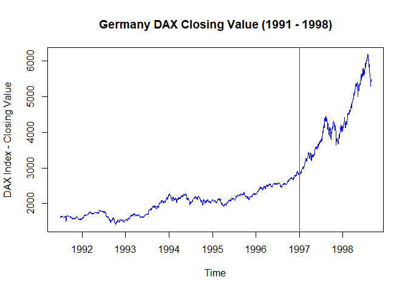
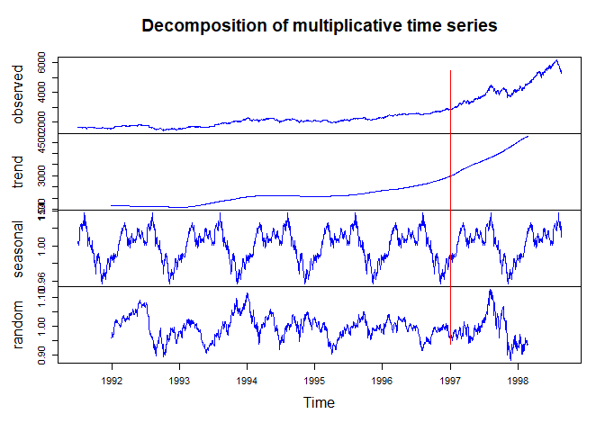
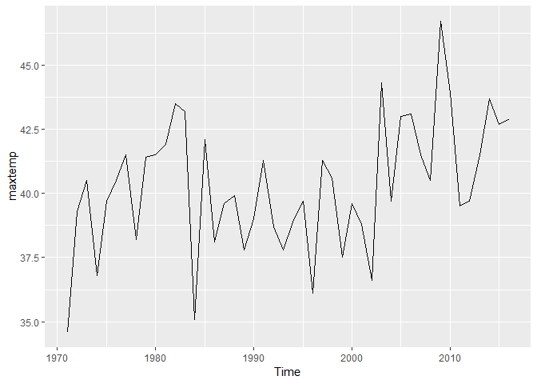
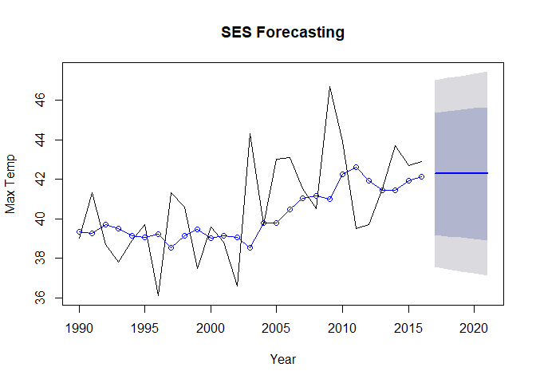
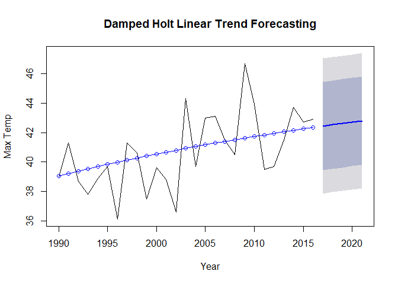

```r
sessionInfo()
```

```
## R version 3.4.2 (2017-09-28)
## Platform: x86_64-w64-mingw32/x64 (64-bit)
## Running under: Windows 10 x64 (build 17134)
## 
## Matrix products: default
## 
## locale:
## [1] LC_COLLATE=English_United States.1252 
## [2] LC_CTYPE=English_United States.1252   
## [3] LC_MONETARY=English_United States.1252
## [4] LC_NUMERIC=C                          
## [5] LC_TIME=English_United States.1252    
## 
## attached base packages:
## [1] stats     graphics  grDevices utils     datasets  methods   base     
## 
## loaded via a namespace (and not attached):
##  [1] compiler_3.4.2  backports_1.1.2 magrittr_1.5    rprojroot_1.3-2
##  [5] tools_3.4.2     htmltools_0.3.6 yaml_2.1.14     Rcpp_0.12.16   
##  [9] stringi_1.1.5   rmarkdown_1.10  knitr_1.20      stringr_1.2.0  
## [13] digest_0.6.15   evaluate_0.10.1
```


```r
library(dplyr, quietly = TRUE, warn.conflicts =  FALSE)
```

```
## Warning: package 'dplyr' was built under R version 3.4.4
```

```r
library(ggplot2, quietly = TRUE, warn.conflicts = FALSE)
```

```
## Warning: package 'ggplot2' was built under R version 3.4.4
```

```r
library(forecast)
```

```
## Warning: package 'forecast' was built under R version 3.4.4
```

```r
library(fpp2)
```

```
## Warning: package 'fpp2' was built under R version 3.4.4
```

```
## Warning: package 'fma' was built under R version 3.4.4
```

```
## Warning: package 'expsmooth' was built under R version 3.4.4
```

```r
library(dygraphs)
```

```
## Warning: package 'dygraphs' was built under R version 3.4.4
```

```r
library(xts)
```

```
## Warning: package 'xts' was built under R version 3.4.4
```

```
## Warning: package 'zoo' was built under R version 3.4.4
```

#Warm Up: Brief Financial Data (20%): 
## A.
Natively in R, you have access to sample data sets of prominent stocks over time.
We'll be using EuStockMarkets for this question. Type help(EuStockMarkets) to learn
more. From these data, pull specifically the DAX index. For all questions in this
assignment, you're welcome to normalize (or don't!) how you see fit, but, if you
choose to, please document what you're doing and why for the grader. It's not
necessary for the purpose of this assignment.


```r
#help(EuStockMarkets)
head(EuStockMarkets)
```

```
## Time Series:
## Start = c(1991, 130) 
## End = c(1991, 135) 
## Frequency = 260 
##              DAX    SMI    CAC   FTSE
## 1991.496 1628.75 1678.1 1772.8 2443.6
## 1991.500 1613.63 1688.5 1750.5 2460.2
## 1991.504 1606.51 1678.6 1718.0 2448.2
## 1991.508 1621.04 1684.1 1708.1 2470.4
## 1991.512 1618.16 1686.6 1723.1 2484.7
## 1991.515 1610.61 1671.6 1714.3 2466.8
```

```r
tail(EuStockMarkets)
```

```
## Time Series:
## Start = c(1998, 164) 
## End = c(1998, 169) 
## Frequency = 260 
##              DAX    SMI    CAC   FTSE
## 1998.627 5598.32 7952.9 4041.9 5680.4
## 1998.631 5460.43 7721.3 3939.5 5587.6
## 1998.635 5285.78 7447.9 3846.0 5432.8
## 1998.638 5386.94 7607.5 3945.7 5462.2
## 1998.642 5355.03 7552.6 3951.7 5399.5
## 1998.646 5473.72 7676.3 3995.0 5455.0
```

```r
dax = EuStockMarkets[,'DAX']
str(dax)
```

```
##  Time-Series [1:1860] from 1991 to 1999: 1629 1614 1607 1621 1618 ...
```

## B.

These are annual European Stock Data from 1990 onward. Create a rudimentary plot
of the data. Make the line blue. Give an informative title. Label the axes accurately.
In 1997, an event happened you want to indicate; add a vertical red line to your plot
which divides pre-1997 and post-1997 information.


```r
plot(dax, main = "Germany DAX Closing Value (1991 - 1998)", xlab = "Time", ylab = "DAX Index - Closing Value", col=c("blue"))
abline(v = 1997, col = 'red')
```

<!-- -->

## C
Decompose the time series into its components (i.e., trend, seasonality, random). Keep
in mind that this is a multiplicative model you want. Create a plot of all decomposed
components. As before, make all lines blue and have a vertical divider at the year
1997.


```r
decompose_dax = decompose(dax, "multiplicative")
plot(decompose_dax, col=c("blue"))
abline(v = 1997, col = 'red')
```

<!-- -->


# 2. Temperature Data (40%)
## A. 
Using the maxtemp dataset granted by loading fpp2, there are maximum annual
temperature data in Celsius. For more information, use help(maxtemp). To see what
you're looking at, execute the command in 'Examples' in the help document.


```r
#help(maxtemp)
max.temp = fpp2::maxtemp
str(max.temp)
```

```
##  Time-Series [1:46] from 1971 to 2016: 34.6 39.3 40.5 36.8 39.7 40.5 41.5 38.2 41.4 41.5 ...
##  - attr(*, "names")= chr [1:46] "1971" "1972" "1973" "1974" ...
```

```r
autoplot(maxtemp)
```

<!-- -->

## B.
We are only concerned with information after 1990. Please eliminate unwanted
information or subset information we care about.


```r
max.temp.filt = window(max.temp, start = 1990)
max.temp.filt
```

```
## Time Series:
## Start = 1990 
## End = 2016 
## Frequency = 1 
## 1990 1991 1992 1993 1994 1995 1996 1997 1998 1999 2000 2001 2002 2003 2004 
## 39.0 41.3 38.7 37.8 38.9 39.7 36.1 41.3 40.6 37.5 39.6 38.8 36.6 44.3 39.7 
## 2005 2006 2007 2008 2009 2010 2011 2012 2013 2014 2015 2016 
## 43.0 43.1 41.5 40.5 46.7 43.9 39.5 39.7 41.5 43.7 42.7 42.9
```

## C.
Utilize SES to predict the next five years of maximum temperatures in Melbourne.
Plot this information, including the prior information and the forecast. Add the
predicted value line across 1990-present as a separate line, preferably blue. So, to
review, you should have your fit, the predicted value line overlaying it, and a forecast
through 2021, all on one axis. Find the AICc of this fitted model. You will use that
information later.


```r
fit.ses <- ses(max.temp.filt, h = 5) 

plot(fit.ses, ylab="Max Temp", xlab='Year', main = "SES Forecasting")
lines(fitted(fit.ses), col="blue", type ='o') # Fitted gives values for existing data points
```

<!-- -->

```r
aicc.ses = fit.ses$model$aicc
print (paste0("AICc for SES Model: ",round(aicc.ses,2)))
```

```
## [1] "AICc for SES Model: 141.53"
```

## D. 
Now use a damped Holt's linear trend to also predict out five years. Make sure
initial="optimal." As above, create a similar plot to 1C, but use the Holt fit instead.


```r
fit.holt <- holt(max.temp.filt, initial = "optimal", damped = TRUE, h = 5) # alpha = 0.2, beta = 0.2 other option
plot(fit.holt, ylab="Max Temp", xlab='Year', main = "Damped Holt Linear Trend Forecasting")
lines(fitted(fit.holt), col="blue", type ='o') # Fitted gives values for existing data points
```

<!-- -->

```r
aicc.holt = fit.holt$model$aicc
print (paste0("AICc for Damped Holt Linear Fit Model: ",round(aicc.holt,2)))
```

```
## [1] "AICc for Damped Holt Linear Fit Model: 145.59"
```

## E.
Compare the AICc of the ses() and holt() models. Which model is better here?

* SES seems to be a better model since it has lower AICc score

# 3. The Wands Choose the Wizard (40%)

## A. 
Utilize the dygraphs library. Read in both Unit12TimeSeries_Ollivander and
_Gregorovitch.csv as two different data frames. They do not have headers, so make
sure you account for that. This is a time series of Wands sold over years.


```r
data1 = read.csv("Unit12TimeSeries_Ollivander.csv")
data2 = read.csv("Unit12TimeSeries_Gregorovitch.csv")
str(data1)
```

```
## 'data.frame':	47 obs. of  2 variables:
##  $ X1.1.1970: Factor w/ 47 levels "1/1/1971","1/1/1972",..: 1 2 3 4 5 6 7 8 9 10 ...
##  $ X1345    : int  1304 1168 1252 1296 1458 1443 1282 1450 1338 1063 ...
```

```r
str(data2)
```

```
## 'data.frame':	47 obs. of  2 variables:
##  $ X1.1.1970: Factor w/ 47 levels "1/1/1971","1/1/1972",..: 1 2 3 4 5 6 7 8 9 10 ...
##  $ X1268    : int  1295 1349 1298 1493 1432 1431 1291 1247 1403 1188 ...
```

```r
colnames(data1) <- c("Year","Ollivander Wand Sales")
colnames(data2) <- c("Year","Gregorovitch Wand Sales")
head(data1)
```

```
##       Year Ollivander Wand Sales
## 1 1/1/1971                  1304
## 2 1/1/1972                  1168
## 3 1/1/1973                  1252
## 4 1/1/1974                  1296
## 5 1/1/1975                  1458
## 6 1/1/1976                  1443
```

```r
head(data2)
```

```
##       Year Gregorovitch Wand Sales
## 1 1/1/1971                    1295
## 2 1/1/1972                    1349
## 3 1/1/1973                    1298
## 4 1/1/1974                    1493
## 5 1/1/1975                    1432
## 6 1/1/1976                    1431
```

## B. 
You don't have your information in the proper format! In both data sets, you'll need to
first convert the date-like variable to an actual Date class.


```r
data1$Year = as.Date(data1$Year, "%m/%d/%Y")
data2$Year = as.Date(data2$Year, "%m/%d/%Y")
head(data1)
```

```
##         Year Ollivander Wand Sales
## 1 1971-01-01                  1304
## 2 1972-01-01                  1168
## 3 1973-01-01                  1252
## 4 1974-01-01                  1296
## 5 1975-01-01                  1458
## 6 1976-01-01                  1443
```

```r
head(data2)
```

```
##         Year Gregorovitch Wand Sales
## 1 1971-01-01                    1295
## 2 1972-01-01                    1349
## 3 1973-01-01                    1298
## 4 1974-01-01                    1493
## 5 1975-01-01                    1432
## 6 1976-01-01                    1431
```

## C.
Use the library xts (and the xts() function in it) to make each data frame an xts object
(effectively, a time series). You'll want to order.by the Date variable.


```r
data1.ts = xts(data1$`Ollivander Wand Sales`, order.by = data1$Year)
colnames(data1.ts) = c("Ollivander Wand Sales")
data2.ts = xts(data2$`Gregorovitch Wand Sales`, order.by = data2$Year)
colnames(data2.ts) = c("Gregorovitch Wand Sales")
head(data1.ts)
```

```
##            Ollivander Wand Sales
## 1971-01-01                  1304
## 1972-01-01                  1168
## 1973-01-01                  1252
## 1974-01-01                  1296
## 1975-01-01                  1458
## 1976-01-01                  1443
```

```r
head(data2.ts)
```

```
##            Gregorovitch Wand Sales
## 1971-01-01                    1295
## 1972-01-01                    1349
## 1973-01-01                    1298
## 1974-01-01                    1493
## 1975-01-01                    1432
## 1976-01-01                    1431
```

## D.
Bind the two xts objects together and create a dygraph from it. Utilize the help() index
if you're stuck.

* Give an effective title and x/y axes.
* Label each Series (via dySeries) to be the appropriate wand-maker. So, one
line should create a label for Ollivander and the other for Gregorovitch.
* Stack this graph and modify the two lines to be different colors (and not the
default ones!) Any colors are fine, but make sure they're visible and that
Ollivander is a different color than Gregorovitch.
* Activate a range selector and make it big enough to view.
* Use dyShading to illuminate approximately when Voldemort was revived
and at-large: between 1995 to 1999.
* Enable Highlighting on the graph, so mousing over a line bolds it.


```r
combined = cbind(data1.ts, data2.ts)
head(combined)
```

```
##            Ollivander.Wand.Sales Gregorovitch.Wand.Sales
## 1971-01-01                  1304                    1295
## 1972-01-01                  1168                    1349
## 1973-01-01                  1252                    1298
## 1974-01-01                  1296                    1493
## 1975-01-01                  1458                    1432
## 1976-01-01                  1443                    1431
```

```r
dygraph(combined, main = "Wand Sales: 1971 - 2017", xlab = "Year", ylab = "Wand Sales") %>% 
  dySeries("Ollivander.Wand.Sales", label = "Ollivander") %>%
  dySeries("Gregorovitch.Wand.Sales", label = "Gregorovitch") %>%
  dyOptions(stackedGraph = TRUE, colors = c("Green","Purple")) %>% 
  dyRangeSelector(height = 50) %>%
  dyShading(from = "1995-1-1", to = "1999-1-1", color = "#FFE6E6") %>%
  dyHighlight(highlightCircleSize = 5, highlightSeriesBackgroundAlpha = 0.2, hideOnMouseOut = FALSE, highlightSeriesOpts = list(strokeWidth = 3))
```

<!--html_preserve--><div id="htmlwidget-7da54364c64626e79070" style="width:672px;height:480px;" class="dygraphs html-widget"></div>
<script type="application/json" data-for="htmlwidget-7da54364c64626e79070">{"x":{"attrs":{"title":"Wand Sales: 1971 - 2017","xlabel":"Year","ylabel":"Wand Sales","labels":["year","Ollivander","Gregorovitch"],"legend":"auto","retainDateWindow":false,"axes":{"x":{"pixelsPerLabel":60,"drawAxis":true},"y":{"drawAxis":true}},"series":{"Ollivander":{"axis":"y"},"Gregorovitch":{"axis":"y"}},"stackedGraph":true,"fillGraph":false,"fillAlpha":0.15,"stepPlot":false,"drawPoints":false,"pointSize":1,"drawGapEdgePoints":false,"connectSeparatedPoints":false,"strokeWidth":1,"strokeBorderColor":"white","colors":["Green","Purple"],"colorValue":0.5,"colorSaturation":1,"includeZero":false,"drawAxesAtZero":false,"logscale":false,"axisTickSize":3,"axisLineColor":"black","axisLineWidth":0.3,"axisLabelColor":"black","axisLabelFontSize":14,"axisLabelWidth":60,"drawGrid":true,"gridLineWidth":0.3,"rightGap":5,"digitsAfterDecimal":2,"labelsKMB":false,"labelsKMG2":false,"labelsUTC":false,"maxNumberWidth":6,"animatedZooms":false,"mobileDisableYTouch":true,"disableZoom":false,"showRangeSelector":true,"rangeSelectorHeight":50,"rangeSelectorPlotFillColor":" #A7B1C4","rangeSelectorPlotStrokeColor":"#808FAB","interactionModel":"Dygraph.Interaction.defaultModel","highlightCircleSize":5,"highlightSeriesBackgroundAlpha":0.2,"highlightSeriesOpts":{"strokeWidth":3},"hideOverlayOnMouseOut":false},"scale":"yearly","annotations":[],"shadings":[{"from":"1995-01-01T00:00:00.000Z","to":"1999-01-01T00:00:00.000Z","color":"#FFE6E6","axis":"x"}],"events":[],"format":"date","data":[["1971-01-01T00:00:00.000Z","1972-01-01T00:00:00.000Z","1973-01-01T00:00:00.000Z","1974-01-01T00:00:00.000Z","1975-01-01T00:00:00.000Z","1976-01-01T00:00:00.000Z","1977-01-01T00:00:00.000Z","1978-01-01T00:00:00.000Z","1979-01-01T00:00:00.000Z","1980-01-01T00:00:00.000Z","1981-01-01T00:00:00.000Z","1982-01-01T00:00:00.000Z","1983-01-01T00:00:00.000Z","1984-01-01T00:00:00.000Z","1985-01-01T00:00:00.000Z","1986-01-01T00:00:00.000Z","1987-01-01T00:00:00.000Z","1988-01-01T00:00:00.000Z","1989-01-01T00:00:00.000Z","1990-01-01T00:00:00.000Z","1991-01-01T00:00:00.000Z","1992-01-01T00:00:00.000Z","1993-01-01T00:00:00.000Z","1994-01-01T00:00:00.000Z","1995-01-01T00:00:00.000Z","1996-01-01T00:00:00.000Z","1997-01-01T00:00:00.000Z","1998-01-01T00:00:00.000Z","1999-01-01T00:00:00.000Z","2000-01-01T00:00:00.000Z","2001-01-01T00:00:00.000Z","2002-01-01T00:00:00.000Z","2003-01-01T00:00:00.000Z","2004-01-01T00:00:00.000Z","2005-01-01T00:00:00.000Z","2006-01-01T00:00:00.000Z","2007-01-01T00:00:00.000Z","2008-01-01T00:00:00.000Z","2009-01-01T00:00:00.000Z","2010-01-01T00:00:00.000Z","2011-01-01T00:00:00.000Z","2012-01-01T00:00:00.000Z","2013-01-01T00:00:00.000Z","2014-01-01T00:00:00.000Z","2015-01-01T00:00:00.000Z","2016-01-01T00:00:00.000Z","2017-01-01T00:00:00.000Z"],[1304,1168,1252,1296,1458,1443,1282,1450,1338,1063,1230,1237,1291,1211,1442,1649,1629,1260,1283,1617,1284,1399,1272,1297,1666,1797,1620,450,200,1308,1277,1444,1070,1031,1405,1487,1229,1493,1317,1520,1337,1547,1632,1336,1289,1439,1226],[1295,1349,1298,1493,1432,1431,1291,1247,1403,1188,1555,1512,1552,1023,1190,1197,1120,1119,1319,1692,1452,1494,1346,1519,1580,1623,1863,0,845,858,814,869,864,942,837,838,671,425,634,618,404,758,410,510,103,49,70]],"fixedtz":false,"tzone":"UTC"},"evals":["attrs.interactionModel"],"jsHooks":[]}</script><!--/html_preserve-->

