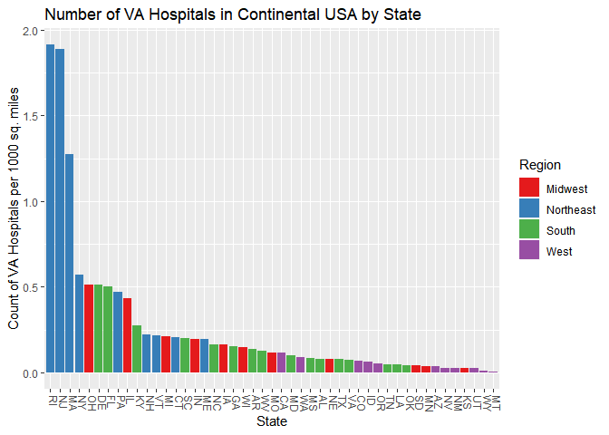

```r
sessionInfo()
```

```
## R version 3.4.2 (2017-09-28)
## Platform: x86_64-w64-mingw32/x64 (64-bit)
## Running under: Windows 10 x64 (build 17134)
## 
## Matrix products: default
## 
## locale:
## [1] LC_COLLATE=English_United States.1252 
## [2] LC_CTYPE=English_United States.1252   
## [3] LC_MONETARY=English_United States.1252
## [4] LC_NUMERIC=C                          
## [5] LC_TIME=English_United States.1252    
## 
## attached base packages:
## [1] stats     graphics  grDevices utils     datasets  methods   base     
## 
## loaded via a namespace (and not attached):
##  [1] compiler_3.4.2  backports_1.1.2 magrittr_1.5    rprojroot_1.3-2
##  [5] tools_3.4.2     htmltools_0.3.6 yaml_2.1.14     Rcpp_0.12.16   
##  [9] stringi_1.1.5   rmarkdown_1.10  knitr_1.20      stringr_1.2.0  
## [13] digest_0.6.15   evaluate_0.10.1
```


```r
library(dplyr, quietly = TRUE, warn.conflicts =  FALSE)
```

```
## Warning: package 'dplyr' was built under R version 3.4.4
```

```r
library(ggplot2, quietly = TRUE, warn.conflicts = FALSE)
```

```
## Warning: package 'ggplot2' was built under R version 3.4.4
```

#Background: 
Your organization is responsible for building new VA hospitals in the mainland of the
United States. You are a little overwhelmed by the prospect, not sure which places need the most
help. You decide to begin by exploring healthcare facility data recorded by the U.S. Government.
Disclaimer: While these are real data, the assignment is not an endorsement for any particular
position on medical affairs or building hospitals. It is for instructional use only.

#1. Mental Health Clinics (40%)

##1A. 
This data set is a survey of every known healthcare facility that offers mental health
services in the United States in 2015. Navigate to https://datafiles.samhsa.gov/study-dataset/national-mental-health-services-survey-2015-n-mhss-2015-ds0001-nid17098 and select the R download. Look
through the codebook PDF for an explanation on certain variables. Upon opening the RDA file, the
data set should be inserted into your global environment, which you can then reference.


```r
loaded.vars <- load('N-MHSS-2015-DS0001-data/N-MHSS-2015-DS0001-data-r.rda') 
loaded.vars # check to see what got loaded
```

```
## [1] "mh2015_puf"
```

```r
va <- mh2015_puf # reassign variable to easier to understand name
```


```r
str(va) # Too many variables, hence not outputting here, but used this to explore variables
```

##1B. 
Please create code which lists the State abbreviations without their counts, one
abbreviation per State value. It does not have to in data frame format. A vector is fine.


```r
levels(va$LST) 
```

```
##  [1] "AK    " "AL    " "AR    " "AS    " "AZ    " "CA    " "CO    "
##  [8] "CT    " "DC    " "DE    " "FL    " "GA    " "GU    " "HI    "
## [15] "IA    " "ID    " "IL    " "IN    " "KS    " "KY    " "LA    "
## [22] "MA    " "MD    " "ME    " "MI    " "MN    " "MO    " "MS    "
## [29] "MT    " "NC    " "ND    " "NE    " "NH    " "NJ    " "NM    "
## [36] "NV    " "NY    " "OH    " "OK    " "OR    " "PA    " "PR    "
## [43] "RI    " "SC    " "SD    " "TN    " "TX    " "UT    " "VA    "
## [50] "VI    " "VT    " "WA    " "WI    " "WV    " "WY    "
```

```r
# Levels has spaces, need to delete to make future work easier
levels(va$LST) <- gsub(" ","",levels(va$LST))
print (paste("All State Abbreviations: ", paste(unique(va$LST), collapse = " ")))
```

```
## [1] "All State Abbreviations:  AL AK AZ AR CA CO CT DE DC FL GA HI ID IL IN IA KS KY LA ME MD MA MI MN MS MO MT NE NV NH NJ NM NY NC ND OH OK OR PA RI SC SD TN TX UT VT VA WA WV WI WY AS GU PR VI"
```

##1C.
Filter the data.frame from 1A. We are only interested in the Veterans Administration (VA)
medical centers in the mainland United States - create a listing of counts of these centers by state,
including only mainland locations. Alaska, Hawaii, and U.S. territories should be omitted. DC, while
not a state, is in the mainland, so it should remain included. Convert this to data.frame()


```r
levels(va$FACILITYTYPE) # find the right facility type to filter by
```

```
##  [1] "Psychiatric hospital"                                                                                                    
##  [2] "Separate inpatient psychiatric unit of a general hospital"                                                               
##  [3] "Residential treatment center for children"                                                                               
##  [4] "Residential treatment center for adults"                                                                                 
##  [5] "Other type of residential treatment facility"                                                                            
##  [6] "Veterans Administration medical center (VAMC) or other VA health care facility"                                          
##  [7] "Community mental health center (CMHC)"                                                                                   
##  [8] "Partial hospitalization/day treatment facility"                                                                          
##  [9] "Outpatient mental health facility"                                                                                       
## [10] "Multi-setting mental health facility (non-hospital residential plus outpatient or partial hospitalization/day treatment)"
## [11] "Other"
```

```r
va_byState <- va %>% filter(va$FACILITYTYPE == "Veterans Administration medical center (VAMC) or other VA health care facility") %>% count(LST) # Count is a combination of group_by(LST) and summarize()
```

```
## Warning: package 'bindrcpp' was built under R version 3.4.4
```

```r
drops <- c('AK', 'HI', 'PR', 'AS', 'FM', 'GU', 'MH', 'MP', 'PW', 'PR', 'VI') # States to exclude -- reference http://www.stateabbreviations.us/
va.mainland <- data.frame(va_byState[!(va_byState$LST %in% drops), ])
names(va.mainland) <- c('State','Count') # rename columns or ease of reading
str(va.mainland)
```

```
## 'data.frame':	48 obs. of  2 variables:
##  $ State: Factor w/ 55 levels "AK","AL","AR",..: 2 3 5 6 7 8 9 10 11 12 ...
##  $ Count: int  4 7 4 18 7 1 1 1 27 9 ...
```

##1D. 
Create a ggplot barchart of this filtered data set. Vary the bar's colors by what State it has
listed. Give it an appropriately professional title that is centered. Make sure you have informative
axis labels. The State axis should be readable, not layered over each other. You're welcome to have a
legend or not.


```r
# Reorder is used to arrange states by count; -count in the statement sorts by descending instead of ascending order
ggplot(va.mainland,aes(x=State,y=Count,fill=State)) + 
  geom_bar(aes(reorder(State,-Count)), stat="identity") + 
  theme(axis.text.x = element_text(angle = -90, hjust = 0, vjust = 0), legend.position = "none") +
  ggtitle("Number of VA Hospitals in Continental USA by State") + xlab("State") + ylab("Count of VA Hospitals")  
```

<!-- -->

#2. Cleaning and Bringing in New Features (60%)


##2A. 
This graph (1D) might be somewhat misleading, as bigger states may have more hospitals, but
could be more sparsely located. Read statesize.csv into your R environment. This contains essentially
a vector of square miles for each state. In trying to merge it with your data.frame() from 1C, you find
that they don't match. Use paste() on your LST column in 1C to see what the matter is, and write
what you observe in a comment.


```r
statesize <- read.csv("statesize.csv")
str(statesize)
```

```
## 'data.frame':	50 obs. of  4 variables:
##  $ StateName: Factor w/ 50 levels "Alabama","Alaska",..: 1 2 3 4 5 6 7 8 9 10 ...
##  $ SqMiles  : int  50750 570374 113642 52075 155973 103730 4845 1955 53997 57919 ...
##  $ Abbrev   : Factor w/ 50 levels "AK","AL","AR",..: 2 1 4 3 5 6 7 8 9 10 ...
##  $ Region   : Factor w/ 4 levels "Midwest","Northeast",..: 3 4 4 3 4 4 2 3 3 3 ...
```

```r
final.data <- merge(va.mainland,statesize, by.x = 'State', by.y = 'Abbrev', all.x = TRUE)
str(final.data) # check that merged dataset looks correct
```

```
## 'data.frame':	48 obs. of  5 variables:
##  $ State    : Factor w/ 55 levels "AK","AL","AR",..: 2 3 5 6 7 8 9 10 11 12 ...
##  $ Count    : int  4 7 4 18 7 1 1 1 27 9 ...
##  $ StateName: Factor w/ 50 levels "Alabama","Alaska",..: 1 4 3 5 6 7 NA 8 9 10 ...
##  $ SqMiles  : int  50750 52075 113642 155973 103730 4845 NA 1955 53997 57919 ...
##  $ Region   : Factor w/ 4 levels "Midwest","Northeast",..: 3 3 4 4 4 2 NA 3 3 3 ...
```

```r
anyNA(final.data) # check for NA Values
```

```
## [1] TRUE
```

```r
# we have some NA Values, check which one
final.data[rowSums(is.na(final.data)) > 0,]
```

```
##   State Count StateName SqMiles Region
## 7    DC     1      <NA>      NA   <NA>
```

The issue was that the abbreviated State names in the __VA hospital dataset__ had __spaces__ in it, hence it does not match with the abbreviation in __statesize__ dataset. This has already been fixed in #1, hence we did not see this issue. If it was not fixed, we would have seen this issue now.

##2B.
Correct the problem with the LST column using any method in R that is programmatic and
easily understandable. Once you have made these state abbreviations identical to statesize.csv's
Abbrev column, merge the data.frame() from 1C and statesize.csv in order to add size information.

Note: This has already been corrected in #1 using the __gsub command__, hence merging in 2A was successful.

##2C
Calculate a new variable in your combined data.frame() which indicates the VA hospitals
per thousand square miles.


```r
final.data$num.per.1000.sq.miles <- final.data$Count / final.data$SqMiles * 1000
summary(final.data)
```

```
##      State        Count             StateName     SqMiles      
##  AL     : 1   Min.   : 1.000   Alabama   : 1   Min.   :  1045  
##  AR     : 1   1st Qu.: 2.000   Arizona   : 1   1st Qu.: 37734  
##  AZ     : 1   Median : 5.000   Arkansas  : 1   Median : 53997  
##  CA     : 1   Mean   : 7.396   California: 1   Mean   : 61494  
##  CO     : 1   3rd Qu.: 9.000   Colorado  : 1   3rd Qu.: 80720  
##  CT     : 1   Max.   :27.000   (Other)   :42   Max.   :261914  
##  (Other):42                    NA's      : 1   NA's   :1       
##        Region   num.per.1000.sq.miles
##  Midwest  :11   Min.   :0.00687      
##  Northeast: 9   1st Qu.:0.05030      
##  South    :16   Median :0.11611      
##  West     :11   Mean   :0.25639      
##  NA's     : 1   3rd Qu.:0.21424      
##                 Max.   :1.91388      
##                 NA's   :1
```

##2D.
Create another ggplot which considers the VAs per square thousand miles, rather than just
frequency. 

* Make sure the State axis is readable, like before. Change the title and axes as appropriate.
* Modify the ggplot syntax to make your bars in descending order.
* Color-code the bars based on Region (see the merged data.frame) - however, change the
color scheme from the default. Any set of colors is fine, so long as it is readable.
* Keep the legend - you should have four regions and therefore four colors.


```r
# Omitted NA value -- Washington DC (since size is not available in statesize.csv) 
# Reference: https://stackoverflow.com/questions/43216628/r-ggplot-histogram-bars-in-descending-order
ggplot(na.omit(final.data),aes(x=State,y=num.per.1000.sq.miles,fill=Region)) + 
  geom_bar(aes(reorder(State,-num.per.1000.sq.miles)), stat="identity")  + 
  theme(axis.text.x = element_text(angle = -90, hjust = 0, vjust = 0)) +
  ggtitle("Number of VA Hospitals in Continental USA by State") + xlab("State") + ylab("Count of VA Hospitals per 1000 sq. miles") +
  scale_fill_brewer(palette = 'Set1') 
```

<!-- -->

##2E. 
What patterns do you see? By this metric, is there any region that seems relatively high for
VA medical centers per thousand square miles? How about low? Given these data, what advice
might you give your boss before you start modeling (and why)?

* The __Northeast__ region seems to have the most VA Hospitals per 1000 square miles. 
* The __West__ region seems to have the least VA hospitals per 1000 square miles. 

From the above analysis, it might seem like the states in the West should be targetted for building more VA hospitals since they have the least number of hospitals per 1000 sq. miles. However, this can be a little misleading. States in the Northeast are smaller in size and more densely populated than other states in general. Hence they may need more hospitals per 1000 sq miles to service a potentially larger population of veterans. States in other parts of the country are bigger in size and less densely populated (especially the west). In these states, analysis of VA hospitals needs to take the population density into account. For example, there is no point in building a VA hospital in the middle of a remote location where very few people live in a 1000 mile radius. However, we may need more hospitals in a small region that is more densely populated.

__In conclusion__, more analysis is needed here and needs to take into account not only state populations, but also population densities within each state. Another thing to consider is the number of veretans in each state. Just because a state has a larger size or more population than another state, does not mean that it  will have more veterans than the other state.

